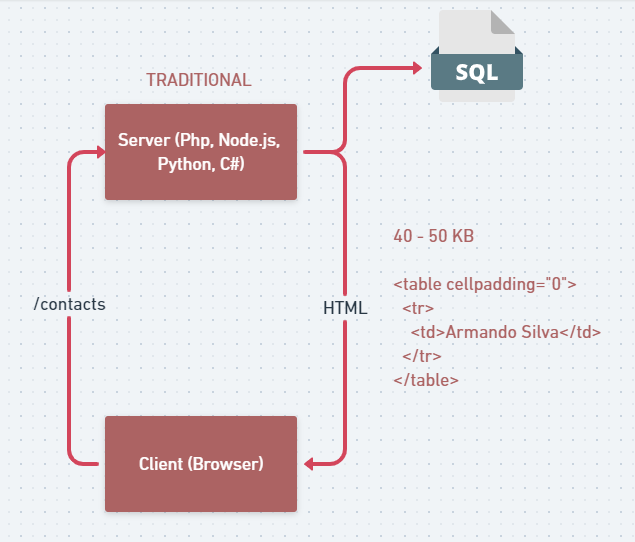
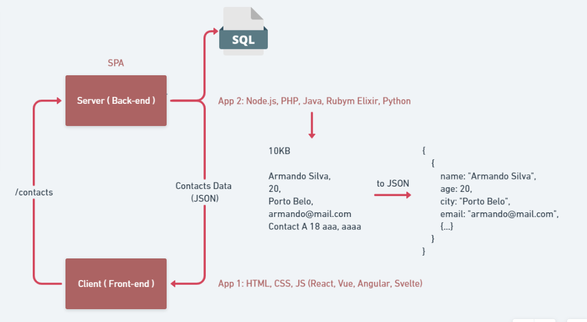
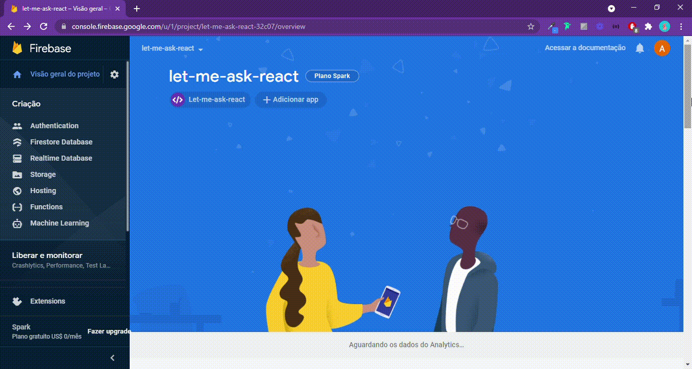

<h1
  align="center"
>
  
</h1>

<h3
  align="center"
>
  Reactjs Web application created in the Next Level Week special edition - Together NLW promoted by <a href="https://rocketseat.com.br/">Rocketseat</a> on the React.js track given by CTO and instructor <a href="https://github.com/diego3g">Diego Fernandes</a>
</h3>

 

  <a
    href="#building-the-project"
  >
    Building the project
  </a>&nbsp;&nbsp;&nbsp;
  <a
    href="#screens"
  >
    Screens
  </a>&nbsp;&nbsp;&nbsp;
  <a
    href="#Layout"
  >
    Layout
  </a>&nbsp;&nbsp;&nbsp;
  <a
    href="#Technologies"
  >
  Technologies
  </a>&nbsp;&nbsp;&nbsp;
  <a
    href="#About-me"
  >
  About me
  </a>

 

<h2
  align="center"
>
  
</h2>
 

## Building the project

 

<h3
>
  Development Environment
</h3>

 

  Our development environment just needs some tools

 

  
    
  
  
    
  
  
    
  

 

<h3
>
  Flow of a SPA
</h3>

 

  In a traditional web application, a page reloads all the data each time the data is fetched or sent by the user to the server, making the application cumbersome to load and a page becoming slower.

  

 

In a SPA (Single Page Application) it happens differently, the data is passed by the server in a JSON file (JavaScript Object Notation) and the page reloads only the necessary component in the page and not the complete page, making the response more fast and the amount of data much smaller

  

 

<h3
>
  Why use Firebase?
</h3>

 

  Firebase is a tool developed by Google and its main proposal is to offer a complete backend service in a <a href="https://en.wikipedia.org/wiki/Banking_as_a_service">single application (BaaS)</a>. So why are we going to use it?
 

 

  :white_check_mark: Easy and fast to use for beginners.

  :white_check_mark: Authentication Services.

  :white_check_mark: database with differentiated management (Data Management System).

  Go to <a href="https://console.firebase.google.com/">here</a> and get started.

 

<h3
>
  Main Concepts about React
</h3>

 

  The main concepts about React.js are <strong>Components</strong>, <strong>Properties</strong> and <strong>State</strong>. I was curious to delve deeper into the subject and read an old Rocketseat article that gives more background on React. <a href="https://blog.rocketseat.com.br/react-do-zero-componentizacao-propriedades-e-estado/">Link here</a>.

 

## Screens

 

The first feature was to create an application in firebase and create authentication and access.

 

<h1
>
  
</h1>

 

## Layout

 

The original layout of the application was created by the UI Designer <a href="https://dribbble.com/rebeccagonzalez">Rebecca Gonzalez</a> and can be found at this <a href="https://www.figma.com/file/u0BQK8rCf2KgzcukdRRCWh/Letmeask/duplicate"> link </a> to the figma.

 

## Technologies

 

 

## About me
